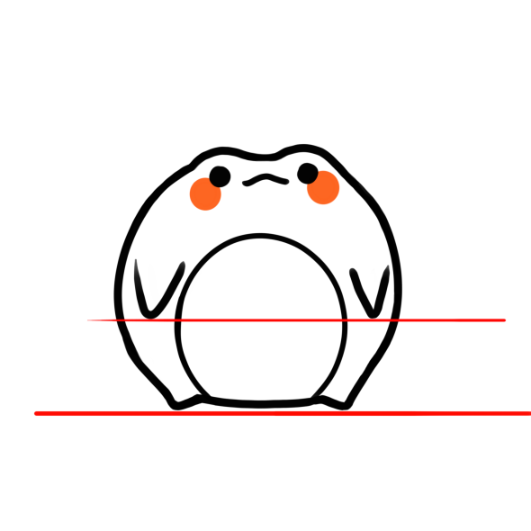

# iti0301-2023-AroundTheWorld

4 players are given controll of one character and have to woek together to progress.

The focus is put on teamwork.
The game should be fun and give players a sense of unity and that they are indispensable.

Feature list:
- Playable characters are frogs.
- Unique powers for different frogs.
- Collectables in form of bugs. Can be used to upgreade your character or unlock alternative styles.
- Story.

