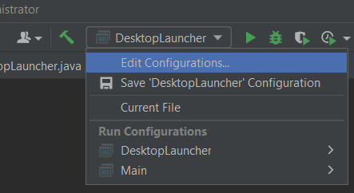
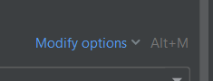
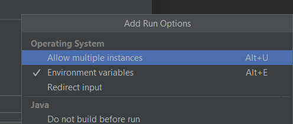
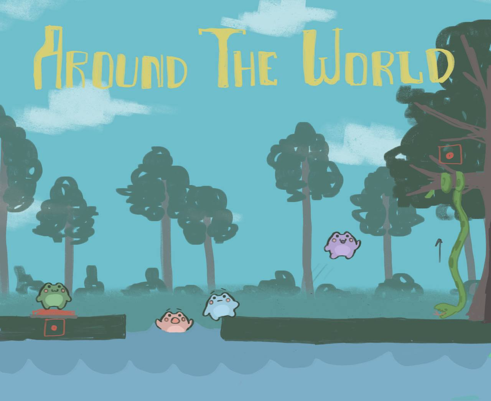

# iti0301-2023-AroundTheWorld

The focus is put on teamwork.
The game should be fun and give players a sense of unity and that they are indispensable.

**AroundTheWorld game description**

The name of our game is 'Around the world', where four players are given control of one character and have to work together to progress. 
The game is about a frog who gets kidnapped by a bird, which leaves it on the tree, and players must go on to collect sticks to make a ladder and save it. 

Feature list:
- Playable characters are frogs.
- Unique powers for different frogs. (maybe)
- Story.

**How to play**

Load server and client from different windows: open server as a new window, then open client as a new window. Otherwise it will not work because the source root is not found (there are two gradles where one is responsible for the client and another one for the server.)

To play the game, you need to clone the HTTP link of this repository into IntelliJ. Gradle offers a "Gradle build scripts found" option at the bottom right, after which you have to press "Load".

First you need to start the server. To do this, go to the Server folder, from there src -> server packet -> ServerFoundation.java. Press the button to run.

Clients can then run the game by running DesktopLauncher.java located in the Client -> desktop -> src -> com.mygdx.game. -> DesktopLauncher.

You can move in the game with WASD buttons, up, left and right buttons.

Multiplayer can be started by running DesktopLauncher several times. If an error occurs, open the white triangle to the left of the "Run" button on the top bar and "Edit configurations...". From there, "Modify options" and "Allow multiple instances".

